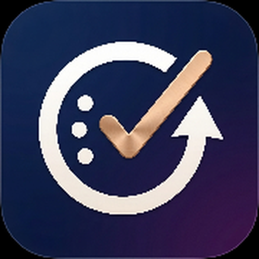

# حياتي — مساعدك الشخصي لتنظيم يومك وحياتك

<div dir="rtl">

تطبيق ويب احترافي (PWA) لإدارة المهام والعادات والتذكيرات والإحصائيات، بتصميم عصري مستوحى من تطبيقات iOS الحديثة، بواجهة عربية RTL كاملة، ويعمل على الهاتف بعد التثبيت.



---

## ✨ المزايا الرئيسية

### 📋 إدارة المهام
- بطاقات ثلاثية الأبعاد متراكبة (Stacked Cards) مثل بطاقات الائتمان
- تصنيفات: عمل، دراسة، شخصي، صحة، عبادة، منزل، أخرى
- أولويات: عالية، متوسطة، منخفضة
- تكرار: لا يتكرر، يوميًا، أسبوعيًا، شهريًا، أيام محددة
- نسبة إنجاز لكل مهمة (0%, 25%, 50%, 75%, 100%)
- إكمال المهمة بأنيميشن سلس و Toast بدلاً من Alert
- صفحة "كل المهام" مع فلترة وبحث وترتيب

### 🔄 العادات
- متابعة السلسلة (Streak) المتتالية
- تقويم أسبوعي صغير لكل عادة
- نسبة الالتزام خلال 30 يوم
- تذكير وقتي لكل عادة
- تسجيل سريع للتنفيذ اليومي

### ⏰ التذكيرات
- نص مخصص + وقت + تكرار (كل 5/10/30/60 دقيقة)
- أيام محددة للظهور
- تفعيل/إيقاف سريع
- إشعارات داخل التطبيق

### 📅 التقويم
- عرض شهري كامل
- مؤشرات على الأيام التي بها مهام
- تفاصيل اليوم عند الاختيار
- عرض مهام وعادات اليوم المختار

### 📊 الإحصائيات
- Donut Chart لإنجاز اليوم
- أشرطة لآخر 7 أيام
- نسبة إنجاز الأسبوع والشهر
- عدد العادات المكتملة + أطول سلسلة

### 🏆 الإنجازات
- أول مهمة مكتملة
- إنجاز 10 / 50 مهمة
- 7 / 30 يوم متتالي
- أسبوع بدون مهام متأخرة
- 5 عادات
- يوم مثالي

### 🎨 التصميم
- **Modern iOS Style** — Minimalist + Premium + Clean
- **Glassmorphism** ناعم مع ظلال دائرية كبيرة
- **بطاقات 3D** بعمق بسيط
- **Gradient** أزرق/سيان في العناصر المهمة فقط
- **RTL عربي** بالكامل
- **Mobile First** — يعمل على Android و iPhone
- **وضع ليلي** كامل بدون flash أبيض

---

## 🎯 الألوان الأساسية

| الاسم | اللون | الاستخدام |
|---|---|---|
| Primary Blue | `#0066FF` | اللون الرئيسي |
| Cyan | `#22B8FF` | اللون الثانوي |
| Background | `#F8F9FA` | خلفية الوضع الفاتح |
| White | `#FFFFFF` | البطاقات |
| Dark | `#101827` | النصوص الأساسية |
| Text | `#111827` | النصوص |
| Muted | `#7B8797` | النصوص الثانوية |

### الوضع الليلي
| الاسم | اللون |
|---|---|
| Background | `#0B1220` |
| Cards | `#111827` |
| Text | `#F8FAFC` |
| Muted | `#94A3B8` |

---

## 📱 تثبيت التطبيق على الهاتف

التطبيق مصمم كـ **PWA (Progressive Web App)** — يمكن تثبيته على الهاتف ويعمل بدون إنترنت.

### 🤖 على Android (Chrome / Edge / Samsung)
1. ارفع مجلد التطبيق على استضافة HTTPS (Netlify, Vercel, GitHub Pages)
2. افتح الرابط من متصفح Chrome على هاتفك
3. سيظهر بانر "تثبيت حياتي على جهازك" تلقائيًا — اضغط **تثبيت**
4. أو من قائمة Chrome ⋮ اختر **تثبيت التطبيق**
5. ستجد أيقونة "حياتي" على شاشتك الرئيسية

### 📱 على iPhone (Safari)
1. افتح رابط التطبيق في Safari
2. سيظهر بانر "ثبّت حياتي على الـ iPhone" مع التعليمات
3. اضغط زر المشاركة ⬆️ في أسفل Safari
4. اختر **إضافة إلى الشاشة الرئيسية**
5. اضغط **إضافة** — وستجد الأيقونة على شاشتك

### 💻 تشغيل محلي للاختبار
```bash
# فك الضغط
unzip hayati-pwa.zip

# تشغيل خادم محلي
python3 -m http.server 8765

# افتح من المتصفح على نفس الشبكة
# http://<your-ip>:8765
```

---

## 🗂️ بنية المشروع

```
hayati/
├── index.html              # الصفحة الرئيسية + Splash
├── manifest.json           # PWA Manifest
├── service-worker.js       # Service Worker (Offline + Push)
├── css/
│   ├── style.css          # التصميم الأساسي (Design System)
│   ├── animations.css     # كل الأنيميشن والـ Transitions
│   └── responsive.css     # Responsive + Dark Mode guards
├── js/
│   ├── storage.js         # localStorage + Date helpers
│   ├── router.js          # Hash router للتنقل
│   ├── notifications.js   # Toasts + التذكيرات الذكية
│   ├── tasks.js           # نظام المهام الكامل
│   ├── habits.js          # العادات + Streaks
│   ├── reminders.js       # التذكيرات المتكررة
│   ├── calendar.js        # التقويم الشهري
│   ├── statistics.js      # الإحصائيات + الإنجازات
│   └── app.js             # المنسق الرئيسي + الإعدادات
└── assets/
    └── icons/
        ├── app-logo.png           # لوجو التطبيق (Header + Splash)
        ├── splash-logo.png        # لوجو Splash Screen
        ├── icon-192.png            # PWA icon (Android)
        ├── icon-512.png            # PWA icon (Large)
        ├── icon-512-rounded.png    # Maskable icon
        ├── apple-touch-icon.png    # iOS icon
        ├── favicon-16.png          # Favicon صغير
        ├── favicon-32.png          # Favicon كبير
        ├── mstile-150.png          # Microsoft tile
        ├── mstile-310.png          # Microsoft tile large
        ├── icon-512.svg            # SVG mask-icon
        ├── shortcut-add.png        # اختصار: إضافة مهمة
        ├── shortcut-habits.png     # اختصار: العادات
        └── shortcut-calendar.png   # اختصار: التقويم
```

---

## 🔧 التقنيات المستخدمة

| التقنية | الاستخدام |
|---|---|
| **HTML5 + CSS3** | البنية والتصميم (بدون frameworks) |
| **Vanilla JavaScript** | منطق التطبيق الكامل (بدون مكتبات) |
| **localStorage** | حفظ البيانات محليًا بشكل دائم |
| **PWA Manifest** | تثبيت التطبيق على الهاتف |
| **Service Worker** | عمل Offline + تخزين ذكي + Push |
| **CSS Variables** | Design System + Dark Mode |
| **CSS Animations** | Micro-interactions ناعمة |
| **backdrop-filter** | Glassmorphism |
| **SVG Inline** | كل الأيقونات (لا مكتبات) |
| **Google Fonts** | Cairo + Tajawal (عربي) |

**لا توجد مكتبات خارجية ضخمة** — التطبيق خفيف وسريع (~100KB قبل الأيقونات).

---

## 🚀 الميزات التقنية

### ✅ PWA قابل للتثبيت
- يعمل Offline بالكامل بعد أول تحميل
- أيقونة مخصصة على الشاشة الرئيسية
- يفتح كتطبيق مستقل (بدون شريط المتصفح)
- اختصارات سريعة (Long-press على الأيقونة)

### ✅ Responsive كامل
- يعمل على Android و iPhone
- متوافق مع الأجهزة الصغيرة (360px) والكبيرة
- يدعم Portrait و Landscape
- لا Horizontal Scroll

### ✅ Accessibility
- `aria-label` على كل الأزرار
- Touch Targets ≥ 44px
- Focus states واضحة
- دعم `prefers-reduced-motion`
- حجم خط قابل للتكبير

### ✅ الأداء
- بدون مكتبات ضخمة
- أنيميشن باستخدام `transform` و `opacity` فقط
- `will-change` للبطاقات النشطة
- تخزين ذكي في Service Worker

---

## 💾 البيانات

كل البيانات محفوظة في **localStorage** تحت namespace `hayati.*`:

| المفتاح | المحتوى |
|---|---|
| `hayati.tasks` | جميع المهام |
| `hayati.habits` | العادات |
| `hayati.habitLogs` | سجل تنفيذ العادات |
| `hayati.reminders` | التذكيرات |
| `hayati.settings` | الإعدادات (Theme, Notifications, ...) |
| `hayati.stats` | الإحصائيات |
| `hayati.user` | اسم المستخدم |
| `hayati.notifs` | سجل الإشعارات |
| `hayati.onboarded` | هل تم أول تشغيل؟ |

### تصدير / استيراد البيانات
من **الإعدادات → تصدير البيانات**: ينزّل ملف JSON يحتوي كل بياناتك.
من **الإعدادات → استيراد البيانات**: يستبدل بياناتك الحالية بملف JSON.

### إعادة الضبط
من **الإعدادات → إعادة ضبط البيانات**: يحذف كل شيء نهائيًا.

---

## 🎛️ الإعدادات

- **الحساب**: تعديل الاسم
- **الإشعارات**: تفعيل/إيقاف
- **صوت التذكير**: تفعيل/إيقاف
- **الرسائل التحفيزية**: تفعيل/إيقاف
- **الوضع الليلي**: تلقائي / مفعّل / معطّل
- **حجم الخط**: عادي / كبير
- **التذكيرات**: إدارة + إضافة + حذف
- **تصدير / استيراد**: JSON
- **إعادة الضبط**: حذف نهائي
- **تثبيت التطبيق**: زر التثبيت اليدوي
- **عن حياتي**: معلومات الإصدار

---

## 📲 الإشعارات الذكية

التطبيق يرسل إشعارات Toast في الحالات التالية:

| الحدث | الرسالة |
|---|---|
| مهمة بعد 10 دقائق | "⏰ لديك مهمة بعد X دقيقة" |
| وقت عادة اليوم | "حان وقت عادة اليوم: X" |
| تذكير متكرر | نص التذكير المخصص |
| إكمال مهمة | "تم إنجاز المهمة ✓" |
| نهاية اليوم (≥70%) | "أحسنت، أنجزت X% من مهامك اليوم" |
| تحديث متاح | "تحديث متاح — سيتم تفعيله عند إعادة الفتح" |
| فتح التطبيق (مرة/يوم) | رسالة تحفيزية عشوائية |

### الرسائل التحفيزية
- "خطوة صغيرة اليوم تصنع فرقًا كبيرًا غدًا"
- "ابدأ بمهمة واحدة فقط"
- "أنت قادر على إنجاز يومك"
- "ركّز على مهمة واحدة في كل مرة"
- "الإنجاز يبدأ بخطوة"
- ...وغيرها

---

## 🌐 الاستضافة

التطبيق يحتاج **HTTPS** لتفعيل PWA و Service Worker. اختر إحدى الطرق:

### Netlify (مجاني)
```bash
# اسحب وأفلت مجلد التطبيق على https://app.netlify.com/drop
# ستحصل على رابط فوري
```

### Vercel
```bash
npm i -g vercel
cd hayati/
vercel
```

### GitHub Pages
```bash
git init && git add . && git commit -m "حياتي"
git branch -M main
git remote add origin https://github.com/USER/hayati.git
git push -u origin main
# فعّل Pages من Settings → Pages
```

---

## 🛣️ الخطوات القادمة (Roadmap)

- [ ] مزامنة سحابية (Firebase / Supabase) — اختياري
- [ ] Web Notifications API للإشعارات حتى والمتصفح مغلق
- [ ] وضع مشاركة المهام
- [ ] Widgets على الشاشة الرئيسية
- [ ] نسخ احتياطي تلقائي
- [ ] دعم اللغة الإنجليزية

---

## 📊 إحصائيات الحجم

| الملف | الحجم |
|---|---|
| HTML + CSS + JS | ~115 KB (مضغوط ~35 KB) |
| أيقونات PWA | ~700 KB |
| Service Worker | ~5 KB |
| **الإجمالي** | **~820 KB** |

---

## 📝 الترخيص

هذا التطبيق جاهز للاستخدام الشخصي والتجاري. صُمم بعناية ليكون نقطة بداية قوية لأي مشروع إنتاجية عربي.

---

## 👨‍💻 المطور

**حياتي** — مساعدك الشخصي لتنظيم يومك وحياتك.

> "نظّم يومك، تغيّر حياتك"

</div>
